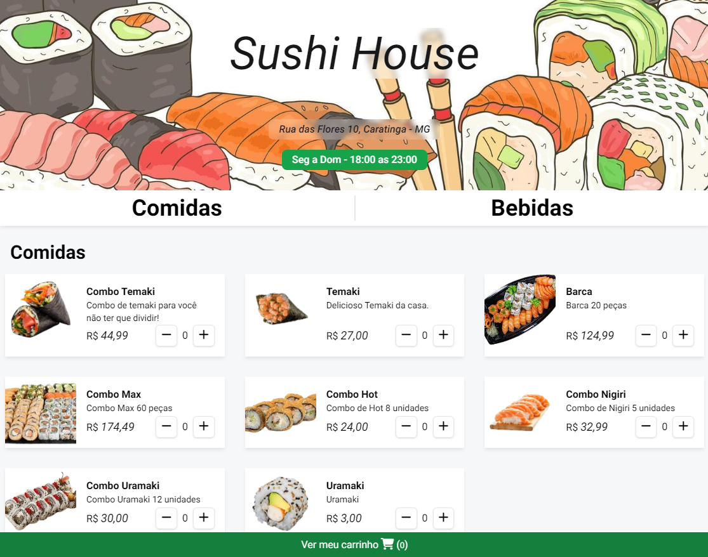
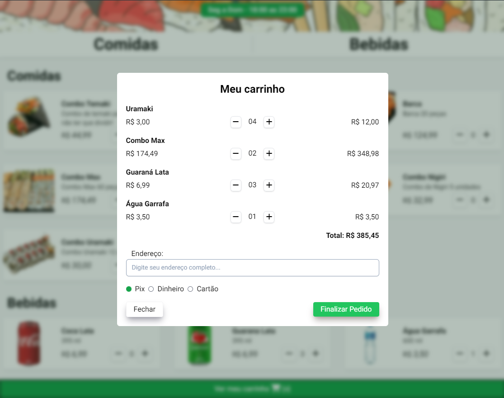
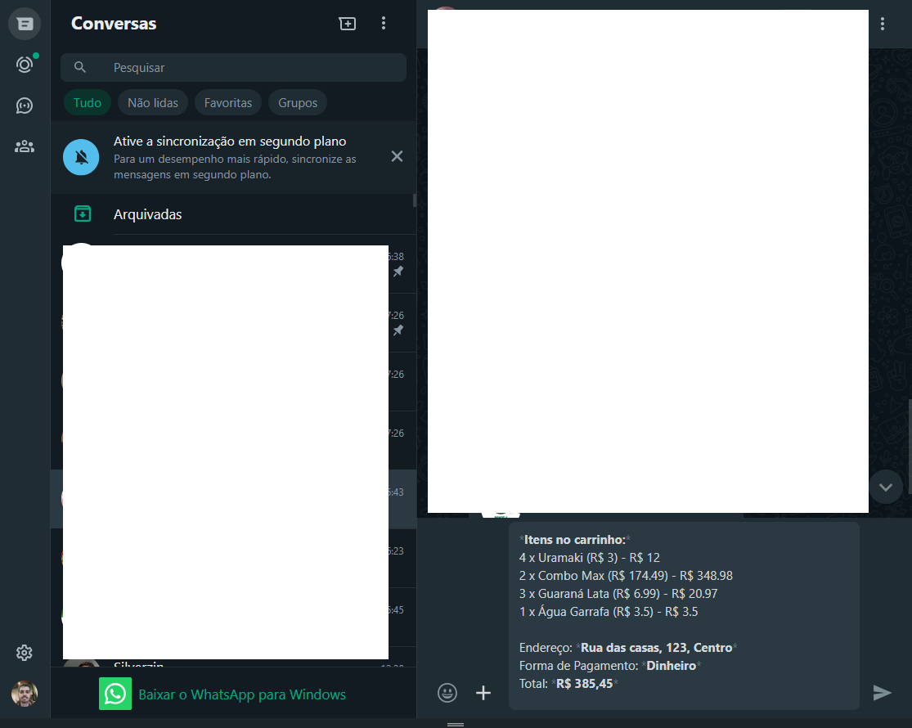

# Cardapio para pedidos online

## Tecnologias
- HTML
- CSS
- Javascript
- Tailwindcss
- Git e GitHub

## Layout Responsivo

Clique em `Play` no vídeo abaixo para ver como o layout da aplicação se adapta de forma responsiva.

